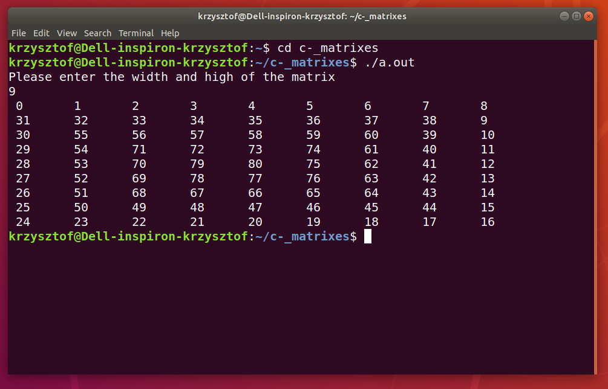

## Table of Contents
* [General Info](#general-info)
* [Technologies](#technologies)
* [Image](#image)

## General Info
This programm can take a value x from the user and draw the matrix x^x, which is filled in spiral from the first line and the first column
to the center of the matrix. The filling starts with number 0 and ends with x^2-1 value

## Technologies
The whole project is written in c++ and works on linux and windows os.

## Image

